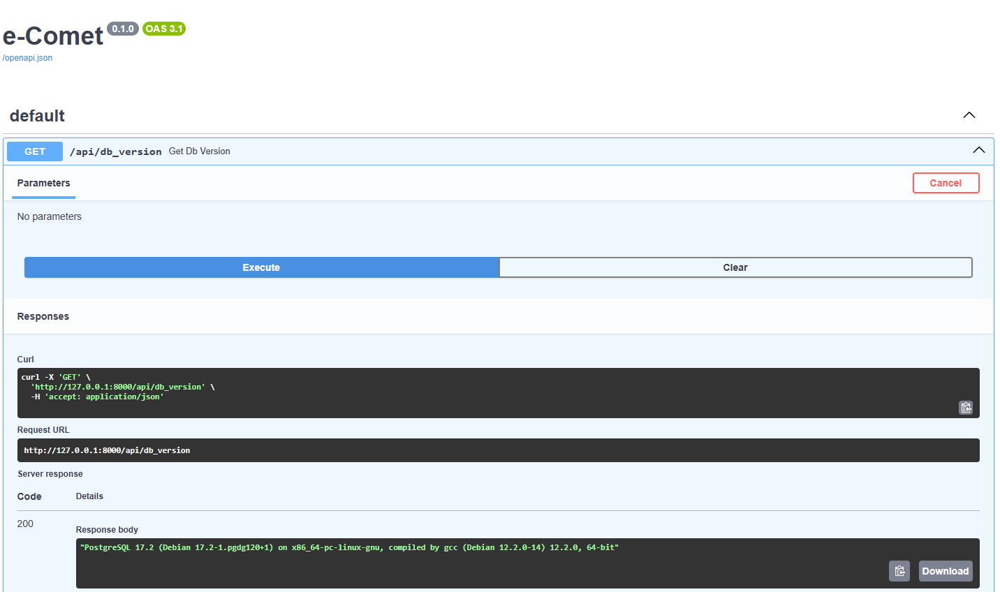

# eCometMiddleBackendTask

## Задачи

### 1. Пул подключений asyncpg

**Условие**: Допишите часть кода, чтобы зависимость *get_pg_connection* действительно возвращала подключение к PostgreSQL в обработчике *get_db_version*.
- Запрещено использовать глобальные переменные и объекты, а также любые механизмы, которые сохраняют данные вне локального контекста функций или методов
- Использовать пул подключений, который предоставляет библиотека *<u>[asyncpg](https://github.com/MagicStack/asyncpg)</u>*

**Локальный запуск**: ```docker compose up --build  task1```

**Решение**:
- [main.py](./1/src/main.py) - Решение
- [settings.py](./1/src/settings.py) - Файл с конфигом проекта
- [utils.py](./1/src/utils.py) - Синглтон для конфига

**Результат**: 


### 2. GithubReposScrapper

**Условие**: Определите метод *get_repositories* в классе *GithubReposScrapper*, который возвращает **Data**-класс *Repository*, где *authors_commits_num_today* - список авторов с количеством коммитов за последний день.
- Отправлять запросы для получения коммитов репозитория <u>АСИНХРОННО</u>
- Ограничить максимальное количество одновременных запросов (**MCR**)
- Ограничить количество запросов в секунду (**RPS**)

**Локальный запуск**: ```docker compose up --build  task2```

**Решение**:
- [limiter.py](./2/src/limiter.py) - Rate Limiter
- [main.py](./2/src/main.py) - Scrapper

**Результат**: 
Elapsed time: 4.66 seconds
```python
Repository(
    name='freeCodeCamp', 
    owner='freeCodeCamp', 
    position=1, 
    stars=409774, 
    watchers=409774, 
    forks=38893, 
    language='TypeScript', 
    authors_commits_num_today=[
        RepositoryAuthorCommitsNum(author='Huyen Nguyen', commits_num=1), 
        RepositoryAuthorCommitsNum(author='Kolade Chris', commits_num=1), 
        RepositoryAuthorCommitsNum(author='Ihechikara Vincent Abba' commits_num=1), 
        RepositoryAuthorCommitsNum(author='Zaira', commits_num=3), 
        RepositoryAuthorCommitsNum(author='Oliver Eyton-Williams', commits_num=1), 
        RepositoryAuthorCommitsNum(author='c0d1ng_ma5ter', commits_num=1), 
        RepositoryAuthorCommitsNum(author='Raymond Liu', commits_num=1), 
        RepositoryAuthorCommitsNum(author='native', commits_num=1)
    ]
)
```

### 3. ClickHouse async saving data

**Условие**: На базе кода из <u>2 задания</u> реализуйте сохранение данных в *ClickHouse* о репозитории, его позиции в топе и количество коммитов авторов (схемы таблиц уже определены в приложении к заданию).
- Использовать библиотеку *<u>[aiochclient](https://github.com/maximdanilchenko/aiochclient)</u>*
- Оптимизировать вставку данных с помощью батчей

**Локальный запуск**: ```docker compose up --build  task3```

**Решение**:
- [clickhouse.py](./3/src/clickhouse.py) - CH Manager
- [main.py](./3/src/main.py) - Solution

**Результат**: 
```
Fetched 100 repositories
Preparing batch insert for 100 repositories
All ClickHouse insertions completed successfully
All repositories saved to ClickHouse
```

| name | owner | stars | watchers | forks | language | updated |
| :--- | :--- | :--- | :--- | :--- | :--- | :--- |
| 30-seconds-of-code | Chalarangelo | 122567 | 122567 | 12077 | JavaScript | 2025-02-08 11:39:26 |
| 996.ICU | 996icu | 270214 | 270214 | 21126 |  | 2025-02-08 11:39:26 |
| AutoGPT | Significant-Gravitas | 171220 | 171220 | 45005 | Python | 2025-02-08 11:39:26 |
| Awesome-Hacking | Hack-with-Github | 88609 | 88609 | 9107 |  | 2025-02-08 11:39:26 |
| CS-Notes | CyC2018 | 178750 | 178750 | 51184 |  | 2025-02-08 11:39:26 |

### 4. YQL-query for CH

**Условие**: Напишите *SQL*-запрос в *ClickHouse*, который достаёт из заданной таблицы по определенной рекламной кампании просмотры по поисковым запросам по часам за сегодня.
Формат ответа должен быть следующим:
| phrase  | views_by_hour                    |
|---------|----------------------------------|
| платье  | (15, 4), (14, 6), (13, 4), (12, 1) |

**Алгоритм**:
Для каждой фразы (используем группировку) и часа в вычисляем максимальное число просмотров (т.к. просмотры монотонно увеличиваются, достаточно взять максимум). С помощью `lagInFrame` берем число просмотров за предыдущий час и вычитаем из текущего, получая число просмотров, которое прибавилось за час. Если предыдущего значения нет, то
- в запросе без анализа предыдущих дат, для первого часа берем **минимальное** число просмотров за сегодня
- в запросе с анализом предыдущих дат, для первого часа берется **последнее** число просмотров до сегодня

Первый алгоритм работает неточно (если до сегодня для первого часа число просмотров изменилось, то этого не будет в результате), но быстрее.
Второй работает точно, но медленнее, так как анализирует предыдущие записи.
Можно взять решение, которое больше подходит под бизнес требования.

**Решения**:

- [Без использования предыдущих дат](./4/solution.sql)
```sql
WITH
    hourly_views AS (
        SELECT
            phrase,
            toHour(dt) AS hour,
            min(views) AS min_views,
            max(views) AS max_views
        FROM phrases_views
        WHERE dt >= today()
          AND campaign_id = ?
        GROUP BY phrase, hour
    ),
    hourly_diffs AS (
        SELECT
            phrase,
            hour,
            max_views - lagInFrame(max_views, 1, min_views) OVER (PARTITION BY phrase ORDER BY hour) AS views_diff
        FROM hourly_views
    )

SELECT
    phrase,
    groupArray((hour, views_diff)) AS views_by_hour
FROM hourly_diffs
WHERE views_diff IS NOT NULL AND views_diff > 0
GROUP BY phrase;

```

- [С использованием предыдущих дат](./4/advanced.sql)
```sql
SELECT
    phrase,
    groupArray((hour, views_diff)) AS views_by_hour
FROM (
    -- Основной запрос, считающий разницу просмотров
    SELECT
        pv.phrase,
        toHour(pv.dt) AS hour,
        max(pv.views) AS max_views,
        max_views - lagInFrame(max_views, 1, COALESCE(prev_max_views, 0))
            OVER (PARTITION BY pv.phrase ORDER BY toHour(pv.dt)) AS views_diff
    FROM phrases_views AS pv
    -- Оптимизированный подзапрос для поиска числа просмотров до today()
    LEFT JOIN (
        SELECT
            phrase,
            max(views) AS prev_max_views
        FROM phrases_views
        WHERE campaign_id = ?
          AND dt < today()  -- Берем максимум просмотров только до сегодняшнего дня
        GROUP BY phrase
    ) AS pv_prev USING (phrase)
    WHERE pv.dt >= today()
      AND pv.campaign_id = ?
    GROUP BY pv.phrase, hour, prev_max_views
) AS hourly_diffs
WHERE views_diff IS NOT NULL AND views_diff > 0
GROUP BY phrase;
```

**Результат**: 
| phrase | views_by_hour |
| :--- | :--- |
| платье | [('12', 1), ('13', 4), ('14', 6), ('15', 4)] |

#### Другие требования:
- Решение должно быть выложено на GitHub
- Python 3.11+, PEP8
- Код должен быть безопасным, с обработчиками ошибок
- Значительное внимание уделить архитектуре и использовать современные решения
- Не использовать хардкод, вместо этого применять конфигурационные файлы, переменные окружения или другие механизмы настройки
- В целом это должен быть production-ready код, в том виде, в котором вы бы его рекомендовали к релизу
